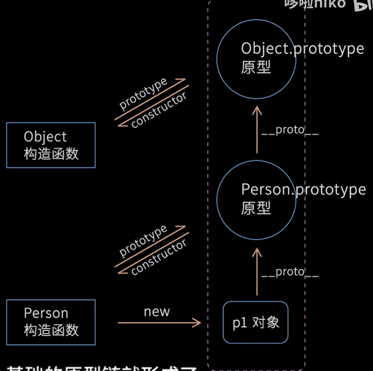
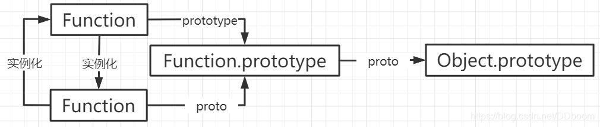

#### 要点记录

1. promise深度理解
2. 发布订阅是很多东西的低层东西, 学会可融会贯通
3. 㣲前端&jsbridge


# css

## postion & zindex 问题

- z-index 只有在`position`属性不为`static`的元素上才有效

- 当relative 父元素设置了 `z-index` 后，其子元素所设置的 `z-index` 都将在父元素内进行排列，这种情况下的子元素不会与父元素外部其他元素出现渲染层次交叉的情况。

# http

## 浏览器缓存


| 请求头            | 响应头                                    | 解释                                                         |
| ----------------- | ----------------------------------------- | ------------------------------------------------------------ |
|                   | **Expires  强缓存**                       | 指定⼀个缓存的过期时间，是绝对时间，客户端本地时间被修改会有影响 |
|                   | **Cache-Control   强缓存**  优先于Expires | 通过 max-age 指定⼀个相对时间，是资源在缓存中的最大有效时间，单位是秒 |
| If-Modified-Since | **Last-Modified    协商缓存**             | `Last-Modified`是服务器响应请求时，返回该资源文件在服务器**最后被修改的时间**<br />`If-Modified-Since`是再次请求该资源文件时，请求头中会带上上次返回的`Last-Modified`时间 |
| If-None-Match     | **ETag          协商缓存**                | `ETag`是服务器响应请求时，返回当前资源文件的一个唯一标识<br />`If-None-Match`是客户端再次发起该请求时，携带上次请求返回的`ETag`值。服务器通过比较这两个值来决定是否返回304状态码或200状态码 |

### 强缓存

强缓存是指浏览器在请求资源时，会先检查本地缓存是否存在该资源的副本，并且该副本是否过期。如果资源的副本未过期，浏览器就直接使用本地缓存，不会向服务器发送请求。强缓存的实现依赖于***HTTP响应头***中的两个字段：`Expires`和`Cache-Control`。

### 协商缓存

若未命中强缓存，或当资源的副本过期或者浏览器的缓存被清除时，浏览器会向服务器发送请求，询问该资源是否有更新。这就是协商缓存的工作机制。协商缓存的实现依赖于HTTP请求头中的`If-Modified-Since`和`If-None-Match`字段，以及HTTP响应头中的`Last-Modified`和`ETag`字段。

- **Last-Modified / If-Modified-Since**：这是HTTP/1.0中使用的协商缓存机制。`Last-Modified`是服务器响应请求时，返回该资源文件在服务器最后被修改的时间。`If-Modified-Since`是再次请求该资源文件时，会带上上次请求中的`Last-Modified`时间。服务器通过比较这两个时间来决定是否返回304状态码（表示资源未修改，使用缓存）或200状态码（表示资源已修改，返回新资源）。
- **ETag / If-None-Match**：这是HTTP/1.1中引入的更精确的协商缓存机制。`ETag`是服务器响应请求时，返回当前资源文件的一个唯一标识（由服务器根据文件信息算法生成，类似hash）。`If-None-Match`是客户端再次发起该请求时，携带上次请求返回的`ETag`值。服务器通过比较这两个值来决定是否返回304状态码或200状态码。

**合理设置缓存头信息**

- **设置适当的`Cache-Control`**：根据资源的类型和使用频率，合理设置`Cache-Control`的`max-age`值。对于频繁访问且更新不频繁的资源（如图片、CSS、JavaScript等），可以设置较长的缓存时间；对于更新频繁的资源（如API接口数据），则设置较短的缓存时间或禁用缓存。
- **使用`ETag`**：对于需要精确控制缓存有效性的资源，可以使用`ETag`来标识资源的版本。这样，即使资源内容有微小变化，也能确保浏览器能够获取到最新的资源。

# js

## 链表

### 特点

> 链表结构是, 每个成员身上带有next或者prev指针, 分别指向不同的成员

1, 链表与数组结构上的区别

数组是有序的 **连续的;  查询快`o(1)`, 新增删除慢`o(n)`**

链表也是有序的, **但是是零散的;  查询慢`o(n)`, 新增删除快`o(1)`**

2, set, map, object

- object是无序的
- set也是无序的
- map是有序的

3, 链表通过表头的节点, 可得知整个结构

**根据数组创建 单向链表**

> 节点之间是通过一种指针(next/prev),  单向串联起来的,  

```js
// 根据数组创建 单向链表
const arr = [1, 5, 8, 0];
function linkedListFn(){
	for (let i = 0; arr < arr.length; i++) {
        const curNode = {
            val: arr[i]
            next: nextNode
        };
        const nextNode = {
            val: arr[i+1],
        }
        
    }
}

```


 

## profetch与dns-pro

 **preload 和 prefetch**

- preload 资源在当前页面使用，会**优先**加载
- prefetch 资源在未来页面使用，**空闲时**加载

**dns-prefetch 和 preconnect**

- dns-prefetch 即 DNS 预查询
- preconnect 即 DNS 预连接

 

## 多进程之node-process

1.主进程

```js
/** /process.js
 * @description fork实现多线程 ('child_process').fork的方式开启多线程
 * 以下为主进程代码
 */
const http = require('http');
console.time("process");
// 引入fork
const fork = require("child_process").fork;
const server = http.createServer((req, res)=>{
    if(req.url==='/get-sum'){
		console.info("主进程id", process.pid);
		/* 开户子进程 */
        // 1 创建子进程
		const childProcess = fork("./child_process.js");
        // 2 告诉子进程开始运行, 并转入以参数
		childProcess.send('开始计算')
        // 5 在主进程中监听子进程的动作
        childProcess.on('message', data=>{
            console.log("主进程接收到子进程的信息", data);
            res.end("hellworld: " + data);
        })
        childProcess.on('close', ()=>{
            console.log("子进程因报错而退出");
            childProcess.kill();
            res.end("error");
        })
	}
})
server.listen(3000, ()=>{
    console.info('localhost:3000')
    // console.time("process");
})
```

2.子进程

```js
/** /child_process.js
 * @description 子进程, 用于计算
 */

function getSum(){
    let sum=0;
    for (let i = 0; i < 10000; i++) {
        sum+=i;
    }
    return sum;
}


// 监听主进程的动作
process.on('message', data=>{
	console.log("子进程id", process.pid);
	// 3 子进程接收来自主进程的信息
	console.log("子进程接收到的信息:", data);
	const sum = getSum(); // 子进程准备好要回传的信息
	// 4 子进程发送回传信息
	process.send(sum);
})
```

 


 

## jsBridge

JSBridge是一种webview侧和native侧进行通信的手段，webview可以通过jsb调用native的能力，native也可以通过jsb在webview上执行一些逻辑。

1. 注册全局api

2. 拦截 URL Scheme

 

## webSocket 

**是HTML5 提供的一种可以在单个 TCP 连接上进行全双工通讯的协议**

 特点: 

 \* 1. 双端通讯, ws协议传输

 \* 2. 没有跨域限制

 \* 3. 通过 send(发送) 和 onmessage(监听消息接收事件) 来进行通讯,不同与http的req,res;

 其原理是: 先建立一个http连接, 成功后升级成ws协议再进行传输通讯

 ```js
/* 服务端 */
// 引入websocker服务模块
const { WebSocketServer } = require("ws");
// 创建一个ws实例, 并指定监听端口
const webServer = new WebSocketServer({ port: 3000 });
// 监听ws服务的连接
webServer.on("connection", (ws) => {
	console.log(ws);
	console.info("已连接 connection");
	// 监听客户端发送来的消息
	ws.on("message", (msg) => {
		console.info("服务端收到的信息为: ", msg.toString());
		// 服务端向客户端发送消息
		setTimeout(() => {
			ws.send("服务端收到了信息并推送");
		}, 2000);
	});
});

 ```

客户端

 ```html
    <button>点击向服务商发送消息</button>
    <script>
        /* 客户端 */

        // 创建一个websocket实例, 协议必须是ws协议
        const ws = new WebSocket('ws://127.0.0.1:3000')
        // websocket连接成功的回调事件: 在这里可向服务端发送消息
        ws.onopen = ()=>{
            console.info('客户端建立连接: opened');
            ws.send('客户端发建立连接成功')
        }
        // 接收服务端推送消息的回调事件: (event.data为服务端传递的数据)
        ws.onmessage = event=>{
            console.log(event);
            console.info('客户端收到了服务端推送为: ', event.data);
        }

        // 点击时向服务商发送消息
        const sendBtn = document.getElementsByTagName('button')[0];
        sendBtn?.addEventListener('click', ()=>{
            console.info('clicked')
            ws.send('clicked当前时间为: ' + Date.now())
        })
    </script>
 ```


 

 

 

## 从输入url到网页显示发生了什么

### 1.  网络请求

- DNS查询（得到IP），建立TCP连接（三次握手）
- 浏览器发起 HTTP 请求
- 收到请求响应，得到 HTML 源代码

### 2. 继续请求静态资源

- 解析HTML过程中，遇到静态资源还会继续发起网络请求
- JS CSS 图片 视频等
- 注意：静态资源可能有强缓存，此时不必请求

### 3. 解析：字符串 --> 结构化数据

- HTML构建DOM树
- CSS构建CSSOM树（style tree）
- 两者结合，形成 render tree

**解析过程很复杂**

- css 可能来自 `<style> <link>`
- JS可能内嵌、外链，还有 `defer` `async` 逻辑
- ``可能内嵌（base64）,可能外链

**优化解析**

1. css 放在`<head>`中，不要异步加载css
2. JS放在`<body>`最下面（或合理使用`defer` `async`）
3. ``提前定义 `width` `height`

### 4. 渲染：Render Tree 绘制到页面

1. 计算各个DOM的尺寸、定位、最后绘制到页面
2. 遇到 JS 可能会执行（参考`defer` `async`）
3. 异步CSS、图片加载，可能会触发重新渲染

### 5. 总结

1. 网络请求：DNS解析，HTTP请求
2. 解析：DOM树，CSSOM树，Render Tree
3. 渲染：计算、绘制，同时执行JS

### 重点 

- 现代浏览器的渲染机制非常复杂，不要纠细节
- 要深入理解 “字符串 -->  结构化数据“ 这一步
- 能画出那张流程图

 


 

 

 

 

 

## 如何实现网页多标签通讯

 ### WebSocket 需要服务端，成本较高

### localStorage 简单易用，推荐

### SharedWorker 调试不方便，不兼容 IE11

- SharedWorker 是 WebWorker 的一种
- WebWorker 可开启子进程执行 JS，但不能操作 DOM
- SharedWorker 可单独开启一个进程，用于同域页面通讯

### 网页和iframe之间通讯

>使用postMessage通讯, 注意跨域的限制和判断
>
>父页面向iframe发送消息: 
>
>**window.iframe.contentWindow****.postMessage("****来自父页面的消息", "\*")**
>
>iframe向父页面发送消息: 
>
>**window.parent****.postMessage("****来自iframe页的消息", "\*")**

 

**示例**

**父页面中:** 


**iframe子页面中:** 

 

**Koa2**

- 一个简约、流行的nodejs框架

- 通过中间件组织代码

- 多个中间件以“洋葱圈模型”执行

 

## 前端常用的设计模式

- 工厂模式
- 单例模式
- 代理模式
- 观察者模式
- 发布订阅模式
- 装饰器模式 

### 观察者模式与发布订阅区别

**观察者模式**

- Subject和Observer直接绑定，没有中间媒介
- 如addEventlistener绑定事件

**发布订阅**

Publisher和Observer互不相识，需要中间媒介 Event channel

- 如EventBus自定义事件


 

 

## vue中做过的优化

##### v-if 和 v-show

##### v-for 使用 key

##### computed 缓存数据

##### keep-alive 缓存组件

##### 异步组件 路由懒加载

##### SSR

 

## 如何统一监听Vue组件报错

 **window.onerror**

- 全局监听所有JS错误
- 但是它是JS级别的，识别不了Vue组件信息
- 捕捉一些Vue监听不到的错误

**errorCaptured生命周期**

- 监听所有下级组件的错误
- 返回false会组上向上传播

**errorHandler配置**

- Vue全局错误监听，所有组件错误都会汇总到这里
- 但errorCaptured返回false,不会传播到这里

**异步错误**

- 异步回调里的错误， errorHandler监听不到
- 需要使用window.onerror

**总结**

- errorCaptured 监听下级组件错误，返回 false 阻止向上传播
- errorHandle 监听全局Vue组件的错误
- window.onerror 监听其它 JS 错误，如异步


## 如果一个h5很慢, 如何排查性能问题?

#### 1、分析性能指标，找到慢的原因

**先了解前端性能指标:**

>**1. First Paint(FP)** **开始渲染**
>
>**2. First Contentful Paint(FCP)** **第一次有内容(哪怕一个字符)的渲染**
>
>**3. First Meaningful Paint(FMP)** **第一次有意义(大概的页面内容出现了)的渲染(已弃用,改用LCP)**
>
>**4. DomContentLoaded(DCL)** **页面的dom全部渲染完成**
>
>**5. Largest Contentful Paint (LCP)** **页面大部分内容都已渲染完了**
>
>**6. Load (L)  window.onload****事件**

**通过工具分析性能指标, 工具有以下:** 

>**1. Performance (****浏览器)**
>
>**2. Network (****浏览器)**
>
>**3. Lighthouse (****流行的第三方性能评测, 支持移动&PC)**


#### 2、对症下药，解决问题

**网页加载慢则**

- 优化服务端硬件配置，使用CDN
- 路由懒加载，大组件异步加载——减少主包的体积
- 优化HTTP缓存策略

**网页渲染慢则**

- 优化服务端接口（如 Ajax 获取数据慢）
- 继续分析，优化前端组件内部的逻辑（参考Vue React优化）
- 服务端渲染 SSR

#### 3、持续跟进，持续优化

- 性能优化是一个循序渐进的过程，不像bug一次性解决
- 持续跟进统计结果，再逐步分析性能瓶颈，持续优化
- 可使用第三方统计服务，如阿里云ARMS、百度统计


## dns

#### dns 预解析

**DNS预解析**（`dns-prefetch` ）是前端网络性能优化的一种措施，它根据浏览器定义的规则，**提前解析**之后可能会用到的域名，使解析结果**缓存到系统缓存**中，缩短DNS解析时间，进而提高网站的访问速度。

> DNS预解析能够让浏览器在用户访问链接之前解析域名，其范围包括文档的所有链接，包括图片、CSS、JS；域名解析后，如果用户确实访问该域名，那么DNS解析时间将不会有延迟。因为预读取会在后台执行，所以DNS很可能在链接对应的东西出现之前就已经解析完毕，这能够减少用户点击链接时的延迟。

**原理**

当浏览器访问一个域名的时候，需要解析一次 DNS，获得对应域名的 ip 地址；在解析过程中，按照如下的顺序逐步读取缓存，直到拿到IP地址：

- 浏览器缓存
- 系统缓存
- 路由器缓存
- ISP(运营商)DNS缓存
- 根域名服务器
- 顶级域名服务器
- 主域名服务器


## new实现

1. 声明一个空对象
2. 新对象继承指定函数的prototype
3. 将指定函数的this指向新对象, 并拿到返回值
4. 若返回值是对象类型, 则将返回值return, 若不是则返回这个新对象

```js

// 模拟new关键字的函数
function myNew(Fn, ...args) {
	// const obj = {};
	// obj.__proto__ = Fn.prototype; y这一步等于  obj = Object.create(Fn.prototype)
	const obj = Object.create(Fn.prototype);
	const result = Fn.apply(obj, args);
	if (typeof result === "object" && result !== null) {
		return result;
	}
	return obj;
}

// 功能测试
function Person(firtName, lastName) {
	this.firtName = firtName;
	this.lastName = lastName;
	return "demo";
}
const tb2 = myNew(Person, 'Chen2', 'Tianbao2');
console.log(tb2)
```


## call, apply, bind实现

#### call

**思路分析**  如何在函数执行时绑定this

> - 如 `const obj = {x: 100, fn(){this.x}}`
> - 执行 `obj.fn()` ,  此时 `fn`内部的 `this` 就指向 `obj`
> - 可借此来实现函数绑定 `this` 

**手写代码:** 


```js
// //传递参数从一个数组变成逐个传参了,不用...扩展运算符的也可以用arguments代替
Function.prototype.myCall = function (context, ...args) {
  //这里默认不传就是给window,也可以用es6给参数设置默认参数
  context = context || window
  args = args ? args : []
  //给context新增一个独一无二的属性以免覆盖原有属性
  const key = Symbol()
  context[key] = this
  //通过隐式绑定的方式调用函数
  const result = context[key](...args)
  //删除添加的属性
  delete context[key]
  //返回函数调用的返回值
  return result
}

const o = { name: 'ifer' }
const obj = {x: 100, fn(){this.x}};
function foo(a, b) {
	console.log(this, a, b) // { name: 'ifer' }
}
foo.myCall(o, 1, 2)
```


#### apply

与call思路一致,  不同之处在于args(不用加...汇集成数组了, 本身就是数组)

```js
  Function.prototype.myApply = function (_this = window, val) {
    // _this => window or o
    // this => foo
    _this._this = this
    // val => [1, 2]
    // o.foo(...[1, 2])
    const result = _this._this(...val)
    delete _this._this
    return result
  }
  
function fn2(a, b){
  console.log(a, b);
}
const obj = {
  name: '张三'
}
fn2.myApply(obj, [1, 2])
```


#### bind

**思路分析:**

1. 返回一个新函数，但不执行
2. 绑定 this 各部分参数
3. 如是箭头函数，无法改变 this，只能改变参数

**手写代码:**

 

 


## 原型及原型链

### 重点

1. **只有函数对象才有prototype, 普通对象没有**
2. **可以被new的, 都是Function类型的;**
3. **查找原型链先看数据类型**
4. **所有构造函数都是`Function`的实例对象**，**包括`Function`自身**

### prototype: 原型

> prototype是函数的一个属性， **本身是一个对象{}**

**`__proto__` : 原型链接点**

> 是对象的一个属性 ， 是个对象{}

**从属关系：** 对象的`__proto__`上**保存**着该对象的**构造函数的prototype**

>当一个对象访问一个属性时， 将先通过`__proto__`找到的上层的prototype, 接着通过上层的**` prototype._proto_`**再往上找，直到找到`Object.prototype._proto_`, 注意： 除了第一层是**`_proto_`，** 往上都是通过 **prototype.__proto**_找到

```js
function Test(){this.a = 1;}
var test = new Test();
// 查找过程：
// test.__proto__ === Test.prototype   
// Test.prototype.__proto__ = Object.prototype
// Object.prototype__proto__ === null
```



### Function Object

Function Object:  是函数 也是对象

- **Function是特殊的，Function.proto 指向他本身的prototype**，即 `Function.__proto === Function.prototype` 

- Object.proto 也指向 Function.prototype，即 Object.__proto === Function.prototype

- **Object.proto === Function.__proto**

- 最终，Function.prototype._proto_ = Object.prototype 最终再指向null

  

>1. **所有构造函数都是`Function`的实例对象**，包括`Function`自身，所有构造函数的`__proto__`都指向`Function.prototype`，即所有构造函数都继承`Function`的原型对象。
>2. 所有原型对象都是`Object`的实例对象，所有原型对象的`__proto__`都指向`Object.prototype`，即所有原型对象都继承`Object`的原型对象。
>3. `Function`可通过`__proto__`访问自己的原型对象，也可通过`prototype`访问自己的原型对象。这是因为`Function`本身也是`Function`的实例对象，把`Function`当成构造函数看，它可通过`prototype`访问原型对象，把`Function`当成实例对象看，它可通过`__proto__`访问原型对象。

### constructor

其实就是一个用来保存自己构造函数引用关系的属性，通过**`对象.contructor` 可以指向创建该对象的构造函数**

**注意：它可以被改变**

```js
test.constructor === Test   // true
```

### instanceof

instanceof 判断**对象是否是**某一**构造函数**（如Array）**的实例**

> 寻找左边的对象的原型链中是否存在右边对象的原型对象。
>
> **内部机制**是通过**判断对象的原型链**中**是不是能找到构造的 prototype**。
>
> 重点关注一下是判断一个对象是否是数据类型**的实例**。在下面这里字面量值，**2， true ，'str'不是实例，所以判断值为false**。
>
> instanceof **可以精准判断引用数据类型，而基本数据类型不能被instanceof精准判断**。
>
> ```js
> console.log(2 instanceof Number);                    // false ('2'不是实例，不能被精准判断)
> ```


### 获取原型的方法

- p.**proto**
- p.constructor.prototype
- Object.getPrototypeOf(p)


 ## 小要点记录

#### forEach如何在不改变原数组的情况下跳出循环
forEach的三人特性

> 1. forEach的回调函数在执行之前已经确定的数组范围（范围）: 因为执行的数组跟传入回调函数中的数据是两个
>
> 2. 回调函数中的值对应的永远是当前
>
> 3. 当回调函数中传入的值不存在， 循环会结束

方法1、throw Error抛出异常来停止循环

方法2、循环中用splice将数组清空，值不存在时便会跳出(之后将清空的成员重新赋值给原数组，保存原数组的不变)

```
var arr = [0, 1, 2, 3, 4, 5]; 
arr.forEach((item, i) => { 
	console.log("object", i); 
	// 当执行到目标项时, 将后面的把arr中的全部成员截取掉，清空数组 
	if (i == 3) { 
		// (截取后将清空的成员重新赋值给原数组，保存原数组的不变) 
		arr = arr.splice(0); 
	} 
});
```

#### arguments ==> args

- 类数组, 可迭代有length, 无数组的方法
- 在函数中作为形参, 如果原本是非数组的集合, 接收时可用...将其集合在一起以数组使用;

#### promise

1. promise.then中如果没有return的不是一个Promise, 或者没return, 将会自行returnPromise出去;

## 原型

1. 只有函数对象才有prototype, 普通对象没有
2. 可以被new的, 都是Function类型的;
3. 查找原型链先年数据类型

### 判断一个对象是否存在某个属性
- key in obj 会沿着对象的原型链寻找所有的键值。
- obj.hasOwnProperty(key) 则只会寻找对象自身的属性(不包括原型链)。

### return break continue的区别

return: 结束当前方法的执行并立即终止，会直接结束整个方法，而不仅仅是跳出循环；

continue: 结束本次循环， 直接进入下次循环；

break: 结束当前的循环，跳出循环。 

- *-break*不仅可以结束其所在的循环，还可以结束**其外层循环（需要在*break*后紧跟一个标签）**。

- 标记语句**可以是任何语句**（通常是[块](https://developer.mozilla.org/zh-CN/docs/Web/JavaScript/Reference/Statements/block)语句），不一定非得是一个循环语句。

```js
break;
break label;		// label 可选: 与要中断的语句的标签关联的标识符
// 示例
outerBlock: {
  innerBlock: {
    console.log("1");
    break outerBlock; // 同时跳出 innerBlock 和 outerBlock
    console.log(":-("); // 跳过这一行
  }
  console.log("2"); // 跳过这一行
}
```


## 项目中的难点： 

1、复杂表单

> 复杂表单, 动态表格多条件联动 , 利用 el-form、el-table 结合 component 动态组件封装实 现最多可支持 15 个模块动态增删改的表单模组组件。

背景：

- 嵌套表单，也是动态表格，多条件联动，
-  支持15 个模块动态增删改的表单模，
- 每个模块中内容为表格或者表单， 表单包括大量表单项

解决：

- 设计嵌套数据结构，维护一个json数据，包含有组件类型，表单字段及类型，rules验证规则等
- 模块较多，需拆分多个组件，相同功能的组件可复用
- 及维护多套数据，建立map结构映射起组件&配置&数据关系维护

2、图表横屏

- 需要将图表、上面的点位、移动tips光标、一组切换数据的按钮(带下拉)的元素都横屏
- 需要注意横屏后，
  1. 原生title的隐藏
  2. 客服按钮的隐藏
  3. 及窗口高度的获取问题： 需要分辨是否是h5，h5没有原生title，不需要高度补充
  4. 图表放大后移动光标的坐标翻转，变更坐标轴（交换x、y）
  5. 下拉tab的定位问题
- 结束横屏后，title、客服按钮的恢复

> 主要就是细节的处理问题，不需要多少复杂的处理方式，活用一些基础知识也能实现，适合业务场景的就好，
>
> 阅读源码也是，看似很庞大很复杂的功能吃透源码，从中能学到别人的思路，也能看到自己的不足，比如说为什么自己之前没有想到这个

3、多模块启动？


 ## 关于简历

关于亮点理解: 


投递技巧

1. 自我介绍简洁明确

2. 收藏岗位可置顶

3. 招呼语尽量自定义

4. 投递时间


 


### 输出题打印结果

1. 答案: 2 4 1 1 2 3