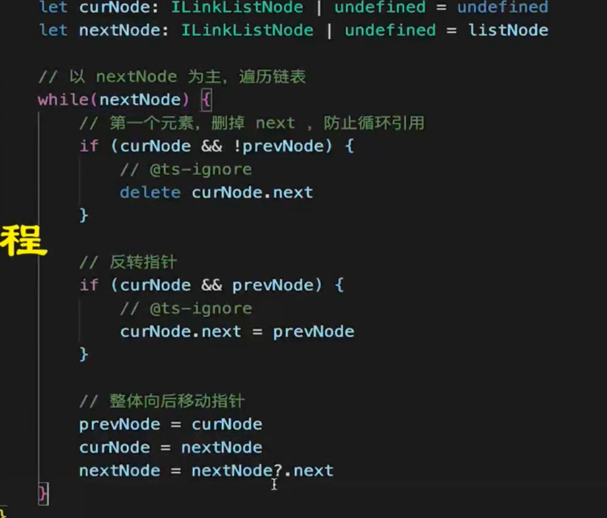
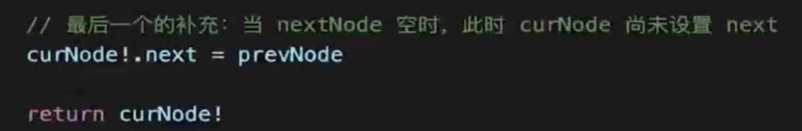

#### 弱点自记

 

1. promise深度理解

2. 发布订阅是很多东西的低层东西, 学会可融会贯通

3. 㣲前端&jsbridge


## 链表

### 知识点

> 链表结构是, 每个成员身上带有next或者prev指针, 分别指向不同的成员

1, 链表与数组结构上的区别

数组是有序的 **连续的;  查询快`o(1)`, 新增删除慢`o(n)`**

链表也是有序的, **但是是零散的;  查询慢`o(n)`, 新增删除快`o(1)`**

2, set, map, object

- object是无序的
- set也是无序的
- map是有序的

3, 链表通过表头的节点, 可得知整个结构

##### 单向链表

> 节点之间是通过一种指针(next/prev),  单向串联起来的,  

```js
const arr = [1, 5, 8, 0];

function linkedListFn(){
	for (let i = 0; arr < arr.length; i++) {
        const curNode = {
            val: arr[i]
            next: nextNode
        };
        const nextNode = {
            val: arr[i+1],
        }
        
    }
}

```


##### 链表反转案例

```js

```







## 手写

##### promise.all

> 返回是个promise, 携带有全部执行成功(数组), 或者最快执行失败的结果;

 ```js
function promiseAll(promises) {
    // promise.all内部返回的也是promise
    return new Promise((resolve, reject) => {
        if (!Array.isArray(promises)) {
            return reject(new Error("传入的不是一个数组"));
        }
        const len = promises.length;
        const result = []; // promise.all最终执行结果返回是返回所有成功的结果的集合,亦或者是最先失败的结果
        let counter = 0; // 记录已执行完成(成功)的数量, 判断结束时机

        for (let i = 0; i < len; i++) {
            Promise.resolve(promises[i])
                .then((res) => {
                    counter++; // 每成功自加1
                    result[i] = res; // 存储当前结果
                    if (counter === len) {
                        // 当最后一个执行完, 改变为resolve状态,并返回结果
                        resolve(result)
                    }
                })
                .catch((err) => reject(err));
        }
    });
}

// 以下功能测试
const p1 = new Promise((resolve, reject)=>{
    setTimeout(() => {
        resolve('p1--success')
    }, 1000);
})
const p2 = new Promise((resolve, reject)=>{
    setTimeout(() => {
        resolve('p2--success')
        // reject('p2--err')
    }, 2000);
})
const p3 = new Promise((resolve, reject)=>{
    setTimeout(() => {
        resolve('p3--success')
    }, 1000);
})
promiseAll([p1, p2, p3]).then(res=>{
    console.log(res, 'promiseall-成功');
}).catch(err=>console.log(err))
 ```

##### promise.race手写

> 赛跑, 抢跑的逻辑, 不管是失败与成功, 最先执行完毕的返回, 并变更执行模板 

```js
function promiseRace(promises) {
    return new Promise((resolve, reject) => {
        for (let i = 0; i < promises.length; i++) {
            Promise.resolve(promises[i]).then(
                (res) => {
                    resolve(res);
                },
                (err) => reject(err)
            );
        }
    });
}

```


##### new关键字

```js
function myNew(Fn, ...args){
    // 创建新对象, 将新对象的原型链指向构造函数的原型对象
    const obj = Object.create(Fn.prototype);
    // 改变构造函数的this指向新对象的this
    const result = Fn.apply(obj, args);
    // 根据返回值判断, 是不是对象方式1:
    if(typeof result === 'Object' && result !== null){
        return result;
    }
    // 根据返回值判断, 是不是对象方式2:
    // if(result instanceof Object){
    //    return result
    // }
    return obj
}
```

/** 1.防抖节流

 \* 防抖: 减少连续执行次数, 防止高密集的执行(注重结果)

 \* 节流: 控制执行频率, 使有节奏的执行(注重过程)

 */


#### 节流防抖

 \* 防抖: 减少连续执行次数, 防止高密集的执行(注重结果)

 \* 节流: 控制执行频率, 使有节奏的执行(注重过程)

**防抖**

```js
function debounce(fn, delay){    

  let timer = null;

  return function(){

     if(timer) {

       clearTimeout(timer);  // 有则先清除, 继续重新开始计时

     };

     timer = setTimeout(() => {

       fn.apply(this, arguments);

       timer = null;

     }, delay);

  }

}
```


**节流**

```js
function throttle(fn, delay){

  let timer = null;

  return function(){

     if(timer)return;   // 有则结束, 暂不触发执行

     timer = setTimeout(() => {

       fn.apply(this, arguments);

       timer = null;    // 后清除

     }, delay);

  }


}
```


##### 排序

###### 冒泡排序

要点: 

1. **最后一个不用循环** (因每层的都是当前的和下一个对比, 最后一个在倒数第二个已做对比)
2. 需要一个标志位 `flag`  用于**判断当前这轮循环中元素是否产生了交换**, 没有则代表已是有序, 需跳出循环**结束排序**;

```js
function bubbleSort() {
    const len = arr.length;
    let flag = false;   // 定一个标志位
    // 从0开始, 最后一个不用循环
    for (let i = 0; i < len - 1; i++) {
        // 从0开始循环
        for (let j = 0; j < len - 1; j++) {
            if (arr[j] > arr[j + 1]) {
                // 交换位置
                const temp = arr[j];
                arr[j] = arr[j + 1];
                arr[j + 1] = temp;
            }
        }
        if(!flag){
            break;      // 如果在某趟排序后, 没有产生任何交换, 证明已经是有序的, 则直接结束排序;
        }else{
            flag = false;       // 如果这趟循环中产生有位置交换, 证明有位置变化, 则将标志位再次重置, 继续下一轮循环
        }
    }

    return arr;
}
// 测试功能
console.log(bubbleSort([5, 0, 8, 1, 6, 3]));
```

##### 快速排序

要点:

1. 取第1个作为中间值,  且循环必须从第2个开始
2. 大于中值的, 与小于中间值的各放一个数组
3. 递归

```js
function quickSort1(arr) {
    if (arr.length <= 1) {
        return arr;
    }

    const median = arr[0]; // 取任意一个作为中间值
    const min = []; // 小于中间值的存放数组(左侧)
    const max = []; // 大于中间值的存放数组(右侧)

    // 从1开始循环!!!
    for (let i = 1; i < arr.length; i++) {
        // 判断小于中间值的(这里 '<'号 or '>'号 决定了升降序)
        if (arr[i] < median) {
            min.push(arr[i]);
        } else {
            max.push(arr[i]);
        }
    }
    return [...quickSort1(min), median, ...quickSort1(max)];
}
// 测试功能
console.log(quickSort1([5, 0, 8, 1, 6, 3]), '----------------==============');
```


##### 求数组中和为target的两个元素

> 实现一个函数, 提供一个数组, 及一个target值,   返回和为target的两个元素, 如:   fn(nums,  3),  ===> return [1, 2]

```js
const nums = [1, 2, 3, 4, 5, 6, 7, 8, 9];
function fn(arr, target) {
    const len = arr.length;
    for (let i = 0; i < len; i++) {
        for (let k = i+1; k < len; k++) {
            if((arr[i]+arr[k])===target){
                return [i, k];
            }
        }

    }			
}
const newArr2 = fn(nums, 8);
console.log("fn: ", newArr2);
```


 

##### 千分位格式化

> 将这种数字 `1910020030405061`转换为 `1,910,020,030,405,061`, 第3位用逗号隔开,  有数组循环和字符串循环两种方式,  
>
> 推荐字符串循环(时间复杂度小)

**数组形式**

思路解析:

1. 将数字==>string===>Array, 并**反转数组**(需从末尾开始循环)
2. 利用reduce方法循环拼接
3. 循环中, 索引能被3整除代表是要加逗号(**0除外**),
4. 因数组反转, 拼接时注意顺序:  **当前值 + 上次累加值**
5. 注意浮点数兼容

```js
/**
 * @description 数字千分位处理--(数组形式)
 */
const num = 10020030405061;
function format1(num){
    num = Math.floor(num);
    const str = num.toString();
    const arr = str.split('').reverse();

    return arr.reduce((prev, cur, idx)=>{
        console.log(prev, cur, idx);
        if(idx % 3 === 0){
            return prev ? cur + ',' + prev : cur;

        } else {
            return cur + prev;
        }
    }, '')
}

// const res = format1(num)
// console.log('format1',res);
```

###### 字符串形式

- 按照字符长度, 从最后一个开始循环字符:  `length -1`
- 拼接逻辑与数组一致
- **!!!注意**: 由于是没有反转, 字符是直接从length长度开始循环的, **所有除余计算需要以从0开始的索引记录, 即:  ` length-i-1`**

```js
const num = 1910020030405061;
function format2(num) {
    const str = Math.floor(num).toString();
    const len = str.length;
    let val = "";
    // 也是从最后一个开始循环, 即length -1
    for (let i = len - 1; i >= 0; i--) {
        const j = len - i - 1;
        // 与数组不同的是, 由于是没有反转, 字符是从length长度开始循环的, 所有除余计算需要从0开始, 即: length-i-1
        if ((j) % 3 === 0) {
            val = val ? str[i] + "," + val : str[i];
        } else {
            val = str[i] + val;
        }
    }
    return val;
}
const a = format2(num)
console.log('format2',a);
```


 

 

##### 旋转数组K步

题目:

> - 输入一个数组[1,2,3,4,5,6,7]
>
> -  k=3, 既旋转3步
>
> - 应输出 [5,6,7,1,2,3,4]

知识点: 

1. 两种方式: 一个是pop + unshift,  一种是 slice + cancat
2. 数组是一个有序结构(连续的内存空间),unshift操作非常慢.push是很快的
3. slice方法不会改变原数组,  当start索引为负数如: `-k`,  则表示是从指倒从第k个开始截取, 直至最后一个
4. 旋转的步数需: 先根据长度取余(兼容k>length的情况), 再取绝对值(兼容负数)

###### 旋转数组 k 步 - 使用pop unshift

>  **循环k步**,  原数组利用循环, 每次删除原数组的最后一个`pop`, 再推到新数组中的头部`unshift`

```js
/**
 * 旋转数组 k 步 - 使用pop unshift
 * 时间复杂度  O(n²) 空间复杂度O(1)
 * @param arr 
 * @param key 
 * @returns 
 */
export function rotate1(arr: number[], key: number): number[] {
  const length = arr.length
  if (!key || length === 0) return arr
  const step = Math.abs(key % length);  // 旋转的步数需: 先根据长度取余(兼容k>length的情况), 再取绝对值(兼容负数)
  // 问:为啥只有一次for循环,不是O(n),而是 O(n²)
  // 答:数组是一个有序结构(连续的内存空间),unshift操作非常慢.push是很快的
  // 所以相当于是for循环一个n,unshfit一个n,所以是n^2
  for (let a = 0; a < step; a++) {
    const n = arr.pop()
    if (n != null) {
      arr.unshift(n)
    }
  }
  return arr
}
const testArr = [1, 2, 3, 4, 5, 6, 7, 8, 9];
console.log(rotate1(testArr, 9 * 10000))

```

###### 旋转数组 k 步 - 使用concat

> `slice`切截取两个数组, `part1`截取到`-k`个(原后半段),  part截取从 `0 ~ k`个(原前半段), 最后两个合并返回

```js
/**
 * 旋转数组k步 - 使用concat
 *  时间复杂度 O(1) 空间复杂度O(n)
 * @param arr 
 * @param key 
 * @returns 
 */
export function rotate2(arr: number[], key: number): number[] {
  const length = arr.length
  if (!key || length === 0) return arr
  const step = Math.abs(key % length);
  //  slice方法不会改变原数组, 所以时间复杂度还是O(1);
  const part1 = arr.slice(-step);  // 如当start索引为负数如: `-k`,  则表示是从指倒从第k个开始截取, 直至最后一个
  const part2 = arr.slice(0, length - step)
  return [...part1, ...part2]
}
```


 

 

##### 是否有效括号判断(利用栈先进后出)


 

 

 

 

## profetch与dns-pro

 


 


 

## 多进程之node-process

1.主进程


 

 

\2. 子进程

 


 

## jsBridge

JSBridge是一种webview侧和native侧进行通信的手段，webview可以通过jsb调用native的能力，native也可以通过jsb在webview上执行一些逻辑。

1. 注册全局api

2. 拦截 URL Scheme

 

## webSocket 

**是HTML5 提供的一种可以在单个 TCP 连接上进行全双工通讯的协议**

 特点: 

 \* 1. 双端通讯, ws协议传输

 \* 2. 没有跨域限制

 \* 3. 通过 send(发送) 和 onmessage(监听消息接收事件) 来进行通讯,不同与http的req,res;

 其原理是: 先建立一个http连接, 成功后升级成ws协议再进行传输通讯

 


 


 

 

 

## 从输入url到网页显示发生了什么

 


 

 


 

 

 

 

 

## 如何实现网页多标签通讯

 


  

  

 

 

#### 网页和iframe之间通讯

>使用postMessage通讯, 注意跨域的限制和判断
>
>父页面向iframe发送消息: 
>
>**window.iframe.contentWindow****.postMessage("****来自父页面的消息", "\*")**
>
>iframe向父页面发送消息: 
>
>**window.parent****.postMessage("****来自iframe页的消息", "\*")**

 

**示例**

**父页面中:** 


**iframe子页面中:** 

 

**Koa2**

 

 

## 前端常用的设计模式

 


 

 

## 观察者模式与发布订阅区别


 


 

 

## vue中做过的优化

 

 

 

## 如何统一监听Vue组件报错

 

 

 


 

 

## 如果一个h5很慢, 如何排查性能问题?

#### 性能分析

**先了解前端性能指标:**

**1. First Paint(FP)** **开始渲染**

**2. First Contentful Paint(FCP)** **第一次有内容(哪怕一个字符)的渲染**

**3. First Meaningful Paint(FMP)** **第一次有意义(大概的页面内容出现了)的渲染(已弃用,改用LCP)**

**4. DomContentLoaded(DCL)** **页面的dom全部渲染完成**

**5. Largest Contentful Paint (LCP)** **页面大部分内容都已渲染完了**

**6. Load (L)  window.onload****事件**

 

**通过工具分析性能指标, 工具有以下:** 

**1. Performance (****浏览器)**

**2. Network (****浏览器)**

**3. Lighthouse (****流行的第三方性能评测, 支持移动&PC)**


## dns

#### dns 预解析

**DNS预解析**（`dns-prefetch` ）是前端网络性能优化的一种措施，它根据浏览器定义的规则，**提前解析**之后可能会用到的域名，使解析结果**缓存到系统缓存**中，缩短DNS解析时间，进而提高网站的访问速度。

> DNS预解析能够让浏览器在用户访问链接之前解析域名，其范围包括文档的所有链接，包括图片、CSS、JS；域名解析后，如果用户确实访问该域名，那么DNS解析时间将不会有延迟。因为预读取会在后台执行，所以DNS很可能在链接对应的东西出现之前就已经解析完毕，这能够减少用户点击链接时的延迟。

**原理**

当浏览器访问一个域名的时候，需要解析一次 DNS，获得对应域名的 ip 地址；在解析过程中，按照如下的顺序逐步读取缓存，直到拿到IP地址：

- 浏览器缓存
- 系统缓存
- 路由器缓存
- ISP(运营商)DNS缓存
- 根域名服务器
- 顶级域名服务器
- 主域名服务器


## new实现

1. 声明一个空对象
2. 新对象继承指定函数的prototype
3. 将指定函数的this指向新对象, 并拿到返回值
4. 若返回值是对象类型, 则将返回值return, 若不是则返回这个新对象

```js

// 模拟new关键字的函数
function myNew(Fn, ...args) {
	// const obj = {};
	// obj.__proto__ = Fn.prototype; y这一步等于  obj = Object.create(Fn.prototype)
	const obj = Object.create(Fn.prototype);
	const result = Fn.apply(obj, args);
	if (typeof result === "object" && result !== null) {
		return result;
	}
	return obj;
}

// 功能测试
function Person(firtName, lastName) {
	this.firtName = firtName;
	this.lastName = lastName;
	return "demo";
}
const tb2 = myNew(Person, 'Chen2', 'Tianbao2');
console.log(tb2)
```


## call, apply, bind实现

#### call

思路分析 


手写代码: 


#### apply

与call思路一致,  不同之处在于args(不用加...汇集成数组了, 本身就是数组)


#### bind

思路分析:


手写代码:


 

 

 

 ## 小要点记录

#### forEach如何在不改变原数组的情况下跳出循环

forEach的三人特性

> 1. forEach的回调函数在执行之前已经确定的数组范围（范围）: 因为执行的数组跟传入回调函数中的数据是两个
>
> 2. 回调函数中的值对应的永远是当前
>
> 3. 当回调函数中传入的值不存在， 循环会结束

方法1、throw Error抛出异常来停止循环

方法2、循环中用splice将数组清空，值不存在时便会跳出(之后将清空的成员重新赋值给原数组，保存原数组的不变)

```
var arr = [0, 1, 2, 3, 4, 5]; 
arr.forEach((item, i) => { 
	console.log("object", i); 
	// 当执行到目标项时, 将后面的把arr中的全部成员截取掉，清空数组 
	if (i == 3) { 
		// (截取后将清空的成员重新赋值给原数组，保存原数组的不变) 
		arr = arr.splice(0); 
	} 
});
```

#### arguments ==> args

- 类数组, 可迭代有length, 无数组的方法
- 在函数中作为形参, 如果原本是非数组的集合, 接收时可用...将其集合在一起以数组使用;

#### promise

1. promise.then中如果没有return的不是一个Promise, 或者没return, 将会自行returnPromise出去;

## 原型

1. 只有函数对象才有prototype, 普通对象没有
2. 可以被new的, 都是Function类型的;
3. 查找原型链先年数据类型

 

 

 

 

 ## 关于简历

关于亮点理解: 


投递技巧

1. 自我介绍简洁明确

2. 收藏岗位可置顶

3. 招呼语尽量自定义

4. 投递时间


 


