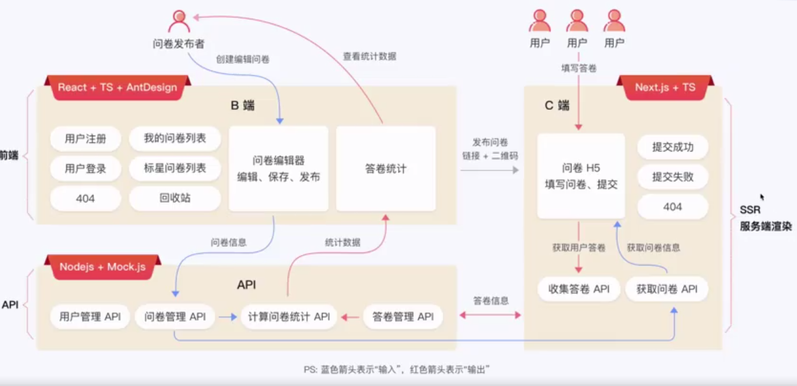

# 前言
项目介绍
> 访问卷星项目;``
>
> - 登录
> - 新建/发布/复制/标星/删除
> - 我的问卷列表(卡片&分页列表 )
> - 问卷信息


### React核心价值: 组件化 & 数据驱动视图
#### 数据驱动视图

> 类比公式  UI = f(state)
> f: 代表函数, 在react中也代表组件
- 定义好数据和UI的显示规则, 即UI = f(state)
- 只关注业务数据的修改, 不用再操作DOM, 增加开发效率
- 尤其对于DOM结构复杂的大型项目


# 课程安排 1/2
1. 创建项目
2. JSX和组件
3. Hooks
4. 使用css样式
5. 路由
6. UI组件库
7. 表单组件
8. ajax网络请求
9. 状态管理
10. 问卷编辑器(项目重点难点)
11. 性能优化
12. 单元测试


## 创建项目
- 使用create-React-App脚手架创建
- 使用vite创建
- 使用eslit prettier husty等, 制定编码规则
- 使用ts

准备工作: node.js + 国内npm镜像 + vscode + 编辑器控制台

### create-React-App
使用一个指令创建
```js
npx create-react-app my-prject --template typescript
// 追加内容: `--template typescript`  代表使用ts
```

## JSX和组件
## Hooks
## 使用css样式
## 路由
## UI组件库
## 表单组件
## ajax网络请求
## 状态管理
## 问卷编辑器(项目重点难点)
## 性能优化
## 单元测试


## 视频进行记录: 3-3  05:57


